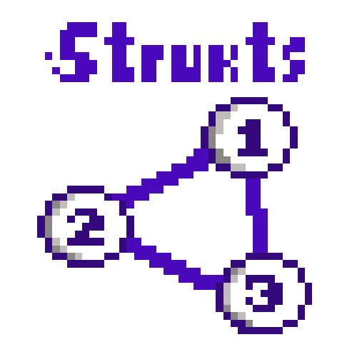

<br clear="left"/><p align="center">  </p>

<h2 align="center">C library with some data structures and algorithms.</h2>

## Table of Contents

- [Strukts](#Strukts)
  - [Requirements](#Requirements)
  - [Dependencies](#Dependencies)
- [Compiling Strukts](#Compiling-Strukts)
- [Compiling Tests](#Compiling-Tests)

## Strukts

Strukts is a library with a few useful data structures that can be reused in other C projects. It's main distribution contains
a static lib, `libstrukts.a` that can be statically linked to other C projects. Moreover, Strukts headers on the [include](include/strukts) folder.

### Requirements

In order to compile Strukts and its tests, it's necessary to have:

- C compiler such as `gcc`, `clang`, etc.
- CMake for building the projects
- C++ compiler such as `g++`, `clang`, etc. (tests only)

### Dependencies

Strukts depends on the following third-party libraries:

- `GoogleTest` library for tests
- `GoogleMock` library for tests

CMake downloads, compiles and links these dependencies automatically when building Strukts.

## Compiling Strukts

First, clone this repo and create a build folder inside the cloned repo folder:

```sh
make build && cd build
```

Then, compile the project with `CMake`:

```sh
cmake .. && make
```

The compiled static library can be found at `build/lib/libstrukts.a`. After that:

- This static lib can be linked to your own project;
- The headers of this lib can be found at `include/strukts`

## Compiling Tests

First, clone this repo and create a build folder inside the cloned folder:

```sh
mkdir build && cd build
```

Then, build the project with `CMake` with the flag `-DWITH_TEST=ON` which will fetch/compile/link the projects dependencies such as the [GoogleTest/GoogleMock](https://github.com/google/googletest) and finally compile and run
the tests:

```sh
cmake -DWITH_TEST=ON .. && make test
```

The test binaries can be found at `build/bin/test` which can be used to rerun the tests if there are no code changes.

`PS`: When any piece of code changes, running the aforementioned command will compile and run the tests again without
downloading external dependencies (faster).
